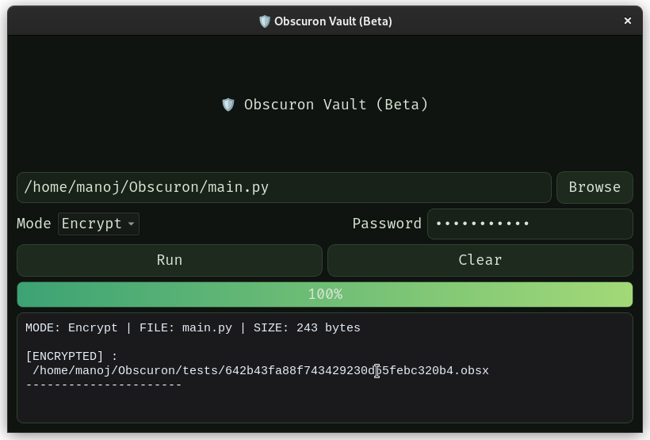
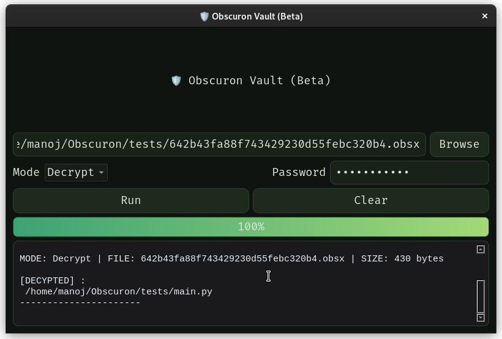

<h1 align="center">🛡️ Obscuron</h1>
<p align="center">
<p align="center">
  <em>An elegant, lightweight yet powerful encryption system built on simplicity, clarity, and trust.</em><br>
  <b>Secure  •  Elegant  •  Adaptive</b>
</p>
<p align="center">
  
  
  
  


</p>
<br>


## ✨ Overview

**Obscuron** is a modern, self-contained file encryption tool designed to provide **strong security through simplicity and elegance.** <br>
Obscuron supports both **Graphical (PyQt5)** and **Command-Line Interfaces**, offering usability for everyday users and power for advanced ones.  <br> It combines **cryptographic precision**, **modern design**, and a **scientific approach to digital safety**.  <br><br>
Obscuron introduces its **own custom encrypted file format : `.obsx`** — ensuring your data remains **fully hidden**, even at the **metadata** level.  
<br>


## 🧭 Core Features (v1.0 beta)

-  **Custom Encryption Format** — proprietary **`.obsx` extension** ensuring complete data and metadata concealment.  
-  **AES-256 Encryption** — powered by **`cryptography`** for strong symmetric protection. unique salt, nonce, and password-derived AES-GCM key.
-  **Dual Interfaces** — intuitive PyQt5 **GUI** and efficient **CLI** mode.  
-  **Error-Aware Design** — gracefully handles invalid passwords and corrupted data.  
-  **Cross-Platform** — fully functional on **Linux, macOS, and Windows.**  
-  **Organic Dark UI Theme** — minimalist, futuristic design inspired by organic aesthetics.
- **Modular design** — ready for extensions and research  
- **Forward vision** — designed for  AI-driven adaptive encryption  

<br>


## Screenshots / Previews

- #### Live Demo  (may take time to load)


- #### Encryption



- #### Decryption



<br>


## Tech Stack

- **Python 3.9+**
  
- **cryptography (AES-GCM, PBKDF2)**

- **Core Modules :** os, json, base64, uuid

- **JSON, Base64 (for internal structured encoding)**

- **PyQt5 (GUI)** with custom QSS theme

- **CLI :** argparse

<br>


## ⚙️ Installation & Setup

### 1. Clone the repository
```bash
git clone https://github.com/m4noj/Obscuron.git
cd Obscuron
```

### 2. Create virtual environment (Optional)
```bash
python3 -m venv obscuron
source venv/bin/activate
pip install -r requirements.txt
```

### 3. Usage

### GUI Mode
```bash
python3 main.py
```
it launches the elegant desktop app:
- **then you can**

    - Select a file to encrypt or decrypt

    - Enter a strong password

    - View progress and logs in real-time

    - Save encrypted or restored files securely

<br>


### Command-Line Interface (CLI)

Obscuron also provides a fast, developer-friendly CLI for advanced users.
```bash
python3 -m app.obsx_cli [command] [options]
```

### Commands:

- **`-i`** / **`--input`** — Path to the file to be encrypted.

- **`-p`** / **`--password`** — Password used for AES-256 encryption

- **`-o`** / **`--output`** — (Optional) name of the encrypted `.obsx` file
  
<br>

### 🔓 Encrypt a File:
```bash
python3 -m app.obsx_cli encrypt -i /path/to/file.txt -p "yourpassword" -o secret.obsx
```
- the flag **`-o`** & custom filename **`secret.obsx`** are optional, as **by default obscuron encrypts even the filename!**

    #### Example Output:

    ```
    Encrypted: secret.obsx
    ```


### 🔐 Decrypt a File:
```bash
python3 -m app.obsx_cli decrypt -i secret.obsx -p "yourpassword" -o restored.txt
```

- If flag **`-o`** is not specified, **Obscuron automatically restores the original filename.**

    #### Example Output:
    ```bash
    Decrypted: restored.txt
    ```


<br>

## The Road Ahead

**Obscuron** will continue evolving toward an **intelligent encryption agent** —
combining **adaptive cryptography, AI-based anomaly detection, and multi-layered key management.**

The long-term goal is to design a **timeless, bulletproof encryption ecosystem built on clarity, logic, and trust.**

<br>

<p align="center"> <b>“In simplicity lies the deepest strength of security.”</b><br> — Obscuron, v1.0 </p> 